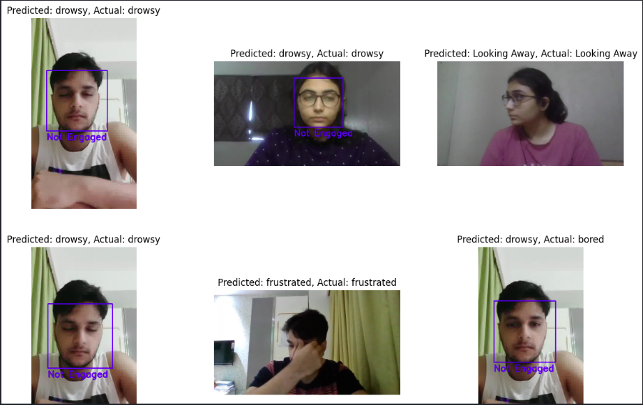
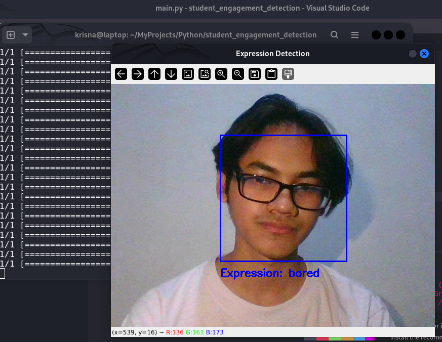
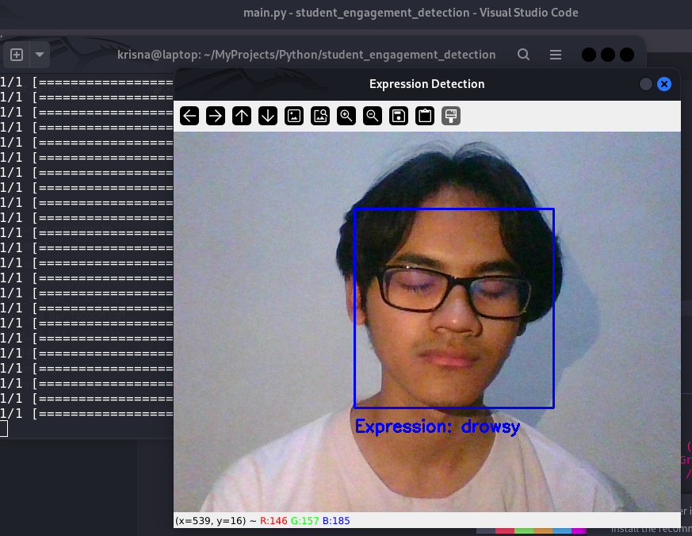
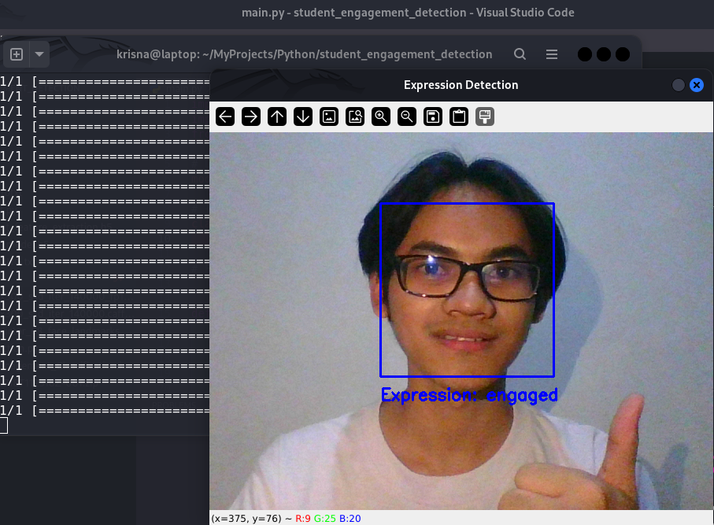
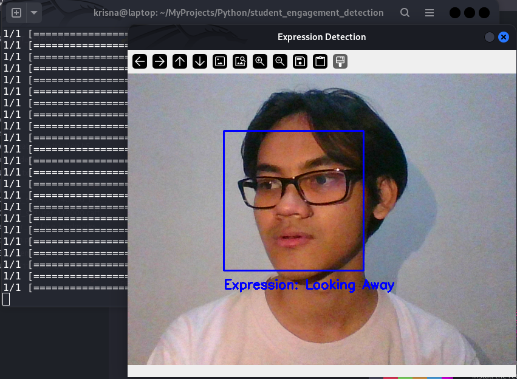

# 🎓 Student Engagement Classification



## 🚀 Project Overview

This project implements a deep learning model to classify student engagement levels based on facial expressions. It's designed to help educators understand and improve student engagement in both traditional and online learning environments.

You can find the notebook with the code [here](Student_Engagement_Classification.ipynb).

## 🎯 Key Features

- Image classification using Convolutional Neural Networks (CNN)
- Data augmentation for improved model generalization
- Real-time face detection and engagement prediction
- Visualization of model predictions

## 🛠️ Technologies Used

- TensorFlow and Keras
- OpenCV
- NumPy
- Matplotlib
- Kaggle API

## 📊 Model Performance

Our model achieved:
- Training Accuracy: 94.89%
- Validation Accuracy: 86.25%

## 🧠 Model Architecture

```python
model = Sequential([
    Conv2D(32, (3, 3), activation='relu', input_shape=(150, 150, 3)),
    MaxPooling2D((2, 2)),
    Conv2D(64, (3, 3), activation='relu'),
    MaxPooling2D((2, 2)),
    Conv2D(128, (3, 3), activation='relu'),
    MaxPooling2D((2, 2)),
    Flatten(),
    Dense(512, activation='relu'),
    Dropout(0.5),
    Dense(6, activation='softmax')  # 6 classes
])
```

## 📁 Dataset

This project used the "Student Engagement" dataset from Kaggle, which includes images of students displaying various levels of engagement:

- Looking Away
- Bored
- Confused
- Drowsy
- Engaged
- Frustrated

## 🖼️ Example Image









## 🚀 Getting Started

1. Clone the repository:
   ```
   git clone https://github.com/KrisnaSantosa15/student-engagement-detection.git
   ```

2. Install dependencies:
   ```
   pip install -r requirements.txt
   ```

3. Download the dataset:
   ```
   kaggle datasets download -d joyee19/studentengagement
   ```

4. Run the Jupyter notebook to train the model and make predictions.

5. Run Python script (After training the model)

## 📈 Results and Visualization

The project includes a function to visualize predictions on test images:

```python
def draw_prediction(image_path, predicted_class):
    # ... (code to draw bounding box and prediction on image)
```

This function draws a bounding box around detected faces and labels them as "Engaged" or "Not Engaged" based on the model's prediction.

## 🔍 Insights and Future Work

- The model shows strong performance in distinguishing between engaged and non-engaged students.
- Future work could focus on improving the model's ability to differentiate between similar engagement states (e.g., confused vs. frustrated).
- Implementing this in a real-time video analysis system could provide valuable insights for educators during live sessions.

## 📚 Resources

- [TensorFlow Documentation](https://www.tensorflow.org/api_docs)
- [OpenCV Documentation](https://docs.opencv.org/master/)
- [Kaggle Student Engagement Datasets](https://www.kaggle.com/datasets/joyee19/studentengagement)

## 🤝 Contributing

Contributions, issues, and feature requests are welcome! Feel free to check [issues page](https://github.com/KrisnaSantosa15/student-engagement-detection/issues).

## 📄 License

This project is [MIT](LICENSE) licensed.

---

If you find this project interesting, don't forget to give it a star! ⭐

Best regards, <br>
Krisna Santosa